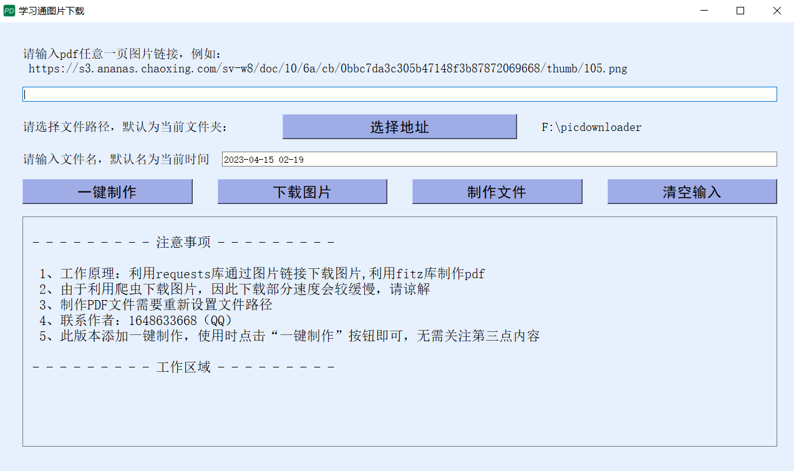

# 一个简短的demo
## 1、开发思路
### 1.1 处理对象
相同url、只在末尾的“.png”区分，例如以下两个url
```html
1、https://s3.ananas.chaoxing.com/sv-w8/doc/51/b5/78/7b35f5bca86c47489c6eef4729fbb686/thumb/1.png

2、https://s3.ananas.chaoxing.com/sv-w8/doc/51/b5/78/7b35f5bca86c47489c6eef4729fbb686/thumb/2.png
```
### 1.2 使用语言及附加库
本程序基于python语言，使用PyQt5构建窗体GUI，使用requests获取图片，使用fitz制作成PDF，使用os库获取路径，同时还使用time、filetype、shutil、sys等
## 2、使用流程
### 2.1 程序界面

### 2.2 使用方法
#### 2.2.1 输入部分
1. 将需要处理的url填入框中
2. 点击“选择地址”按钮，选择存放图片/PDF的地方
3. 输入文件名，默认为当前时间
#### 2.2.2 处理部分
1. 点击“下载图片”按钮，即可下载图片
2. 点击“制作文件”按钮，即可制作成PDF。注意，此步的开始条件是看地址内有无预处理的文件，因此在点击“下载图片”后，若再点击此按钮，请先重新设置地址
3. 若只想得到PDF，建议点击“一键制作”，即可完成包含下载图片和制作文件在内的所有步骤
4. 清空输入即回到默认状态
## 3、声明
本程序制作的PDF是以图片形式插入，因此文件大小会偏大，而且由于放在学习通上面本身就会有很多问题，因此不能保证文件质量。对于老师来说，教师辛辛苦苦制作的课件本身也具有版权，**请同学们下载之后不要乱传文件，也请大家珍惜善良的老师放上的PPT。** 最后，祝同学们都能拥有一个愉悦的体验。
## 4、作者及联系方式
作者：四水合铜离子
联系方式：1648633668@qq.com